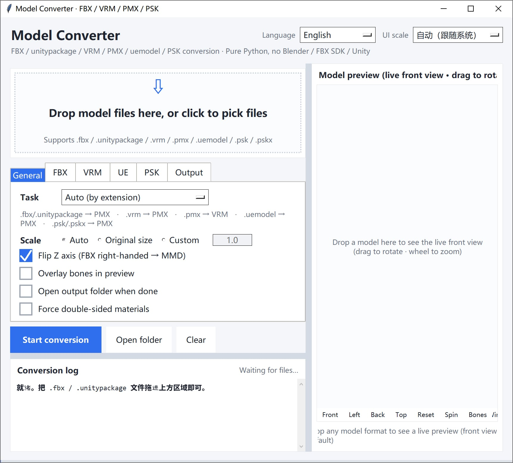

# FBX / VRM / PMX Model Converter (Pure Python)

Convert `.fbx`, `.unitypackage`, `.vrm`, `.pmx`, and `.uemodel` (UEFormat) into each other, **entirely with the Python standard library**.
No Blender / Autodesk FBX SDK / Unity 3D required, and no plugins such as mmd_tools / UniVRM.
It reads and writes the binary formats directly — just drag a file into the window to convert.

[English](README.md) | [简体中文](README_SC.md) | [繁體中文](README_TC.md) | [日本語](README_JP.md)


---

## Download

Download the latest version from [releases](https://github.com/SaraKale/Model-to-PMX/releases/latest).

## 1. Features

### Supported conversion directions

| Direction | Description |
|---|---|
| FBX / unitypackage → PMX | PMX 2.0 for MMD; quads are auto-fan-triangulated |
| VRM (0.x / 1.0) → PMX | Auto-detects humanoid bones; fills missing ones with placeholder bones |
| PMX → VRM (0.x / 1.0) | Auto-writes VRM meta, humanoid bone mapping, and morph targets |
| uemodel (UEFormat) → PMX | Reads the public UEFormat `.uemodel` (v1–v10); can also write an ASCII FBX in the same run |
| PMX → uemodel (UEFormat) | Writes UEFormat `.uemodel` (v9 by default, v10 optional) for the UE / FModel toolchain |
| PMX → validation + preview only | Read-only structural validation; no file output |

### Core features

- **Zero external dependencies**: Pure Python standard library (tkinter + ctypes). `Pillow` is an optional accelerator —
  its absence only affects texture-decode speed and some previews, not the main pipeline.
- **Drag & drop, ready to use**: Uses the native Windows `WM_DROPFILES`; you can drop anywhere in the window, with no
  third-party library like tkinterdnd2.
- **Selected-file list**: after dropping, the files (name / format / size) and the total size are listed right under the drop
  area. You can append more, remove single rows, or double-click one row to preview just that file — so **you can see at a
  glance what this batch will convert**, and nothing runs until you click "Start conversion".
- **Real-time back-view preview**: Drag in a model and see the 3D back view immediately; drag to rotate / scroll to zoom,
  and overlay bone points to check alignment.
- **Multilingual UI**: Switch between Simplified Chinese / Traditional Chinese / English / Japanese in the top-right; the choice is saved to config.
- **HiDPI friendly**: Auto-scales to system DPI; the top-right "UI zoom" lets you set a manual factor.
- **Tabbed options**: The options area is split into five tabs — General / FBX / VRM / UE / Output — for easy extension.
- **Automatic winding-order detection**: Triangle winding is auto-decided by voting between geometric-face normals and vertex normals,
  avoiding large holes / outline lines smearing into black blobs.
- **Texture handling**: PNG/JPEG pass through directly; BMP/TGA are converted to PNG on the fly; embedded in GLB or exported to the PMX directory.

---

## 2. Requirements

- **Windows** (drag & drop and the GUI depend on native Windows APIs)
- **Python 3.10+** (3.12 / 3.13 / 3.14 recommended; must ship with tkinter)
- **Optional**: `Pillow` (accelerates texture decoding and preview)

---

## 3. Directory structure

```
Model-to-PMX/
├── main.py                      # ★ GUI entry point (full implementation)
├── main.spec                    # ★ PyInstaller build config
├── config.json                  # UI settings (language / zoom / options, etc.)
│
├── formats/                     # Format read/write / unpack
│   ├── fbx_reader.py            #   Binary FBX 7.x parser library
│   ├── fbx_probe.py             #   Probe FBX structure (mesh/bones/skinning list)
│   ├── pmxio.py                 #   Full PMX 2.0 read/write (incl. morph/IK/additional/rigidbody/joint)
│   ├── vrmio.py                 #   GLB/glTF container read/write + PNG encode + BMP/TGA decode
│   ├── uemodelio.py             #   UEFormat .uemodel read/write (v1–v10)
│   ├── fbxout.py                #   ASCII FBX 7.4 writer (the "also export FBX" option)
│   └── unitypackage_unpack.py   #   Unpack .unitypackage (gzip tar)
│
├── convert/                     # Conversion engine
│   ├── fbx2pmx.py               #   FBX → PMX
│   ├── vrm2pmx.py               #   VRM → PMX
│   ├── pmx2vrm.py               #   PMX → VRM
│   ├── uemodel2pmx.py           #   uemodel (UEFormat) → PMX (+ optional ASCII FBX)
│   ├── pmx2uemodel.py           #   PMX → uemodel (UEFormat)
│   └── pmx_check.py             #   PMX validation + software-rendered preview image
│
├── gfx/
│   └── preview.py               # Real-time 3D back-view preview widget
│
```

> Engine modules are grouped by responsibility into the `formats/` `convert/` `gfx/` sub-directories. At runtime
> `main.py` inserts these three directories into `sys.path`, so modules still use bare-name `import`s (e.g. `import fbx2pmx`).

---

## 4. Usage

### Method 1: Graphical interface (recommended)

1. Run `python main.py`
2. **Drag** a `.fbx` / `.unitypackage` / `.vrm` / `.pmx` / `.uemodel` file **anywhere into the window**, or click the drop area to choose a file.
   **Dropping only loads the file and shows the preview — nothing is converted automatically.**
   Check the task direction and options, then click "Start conversion" to run.
3. A **selected-file list** (file name / format / size) appears under the drop area, so you can see at a glance what will be converted:
   - dropping again **appends** to the list; duplicates are skipped by absolute path;
   - double-click a row to preview just that file;
   - select rows and click "Remove selected" (or press Delete), or "Clear list" to start over;
   - while the list has files, the drop area shrinks into a thin strip so the list gets the vertical space.
4. The "Task" dropdown can manually specify the conversion direction; by default it is auto-detected from the file extension. Switching the task re-filters the already-loaded files (the list updates too).
5. Conversion log sits at the bottom-left; the model preview is the full-height right column.

UI highlights:

- **Split view**: drag the divider in the middle to resize, just like Blender's areas; the position is saved in `config.json`
- **Full-height preview column**: live back view, with Front / Left / Back / Top / Reset / Spin / Bones / Wire in the toolbar below it
- **Render backend badge (bottom-right of the preview)**: shows whether `Pillow` or pure Python is in use, plus the last frame time in ms
- **"Language" (top-right)**: Simplified Chinese / Traditional Chinese / English / Japanese (the preview toolbar follows too)
- **"UI zoom" (top-right)**: Auto-follows system DPI, or set a manual factor
- **Option tabs**: General / FBX / VRM / UE / Output, five tabs
- **UE tab**: when the `.uemodel` → PMX task is selected, tick "also export an FBX file" to get an ASCII FBX next to the PMX; the same tab sets target height (cm) and alpha handling
- **Textures in the exported FBX**: the written FBX **flips the UV V axis** (PMX/MMD put the UV origin top-left, FBX / Blender / Maya bottom-left) and references textures as a relative path `textures/…`. Keep the FBX next to the PMX together with its `textures` folder — otherwise the shape looks right but the patterns are shifted all over
- **Enlarged checkboxes**: The checkboxes and click areas are easier to hit

### Why the preview stays smooth on heavy models

The live preview is a pure-Python software rasterizer (no OpenGL), so it works in three layers:

1. **Decimated mesh while dragging** — interactively renders ~12k triangles, so a
   90k-triangle model costs about 40 ms per frame;
2. **Sliced refinement after you stop** — the refined frame advances 1500 triangles
   per slice, capped at 24 ms per time slice, so the picture sharpens piece by piece
   without freezing the UI;
3. **Adaptive pixel budget** — resolution scales with the measured frame time, and
   Pillow (when installed) upscales the low-res result to canvas size in C.

### Method 2: Command line

> Always wrap paths containing spaces or non-ASCII characters in double quotes; engine scripts live in the `convert/` `formats/` sub-directories.

```powershell
# Open the GUI
python main.py

# FBX → PMX
python convert/fbx2pmx.py "model.fbx" -o "model.pmx"

# Unpack a unitypackage (--list lists contents without unpacking)
python formats/unitypackage_unpack.py "pack.unitypackage" --list
python formats/unitypackage_unpack.py "pack.unitypackage"

# Probe FBX structure
python formats/fbx_probe.py "model.fbx"

# PMX → VRM 1.0 (default) / 0.x
python convert/pmx2vrm.py "model.pmx" -o "model.vrm"
python convert/pmx2vrm.py "model.pmx" --spec 0x --title "Name" --author "Author"

# VRM → PMX (textures auto-exported to the PMX directory)
python convert/vrm2pmx.py "model.vrm" -o "model.pmx"

# uemodel (UEFormat) → PMX; add --fbx to also write an ASCII FBX next to the PMX
python convert/uemodel2pmx.py "model.uemodel" -o "model.pmx"
python convert/uemodel2pmx.py "model.uemodel" -o "model.pmx" --fbx

# PMX → uemodel (UEFormat v9 by default; --version 10 for the newer layout)
python convert/pmx2uemodel.py "model.pmx" -o "model.uemodel"
python convert/pmx2uemodel.py "model.pmx" -o "model.uemodel" --version 10

# PMX validation + generate preview image
python convert/pmx_check.py "model.pmx"
python convert/pmx_check.py "model.pmx" --bones   # overlay bone positions

# Change a PMX's text encoding to UTF-16LE (fix for files from older builds)
python formats/pmxio.py "model.pmx"               # writes model_utf16.pmx
python formats/pmxio.py "model.pmx" --in-place    # overwrite (back up first)
```

#### Common options quick reference

`fbx2pmx.py`:

| Option | Description |
|---|---|
| `--scale mmd` | Default; auto-scale to MMD standard height (≈ 20 units) |
| `--scale raw` | Keep FBX's original size (meters) |
| `--scale 12.5` | Manually specify a scale factor |
| `--no-flip-z` | Skip right-handed → left-handed conversion (on by default) |
| `--info` | Only print structure info, no conversion |

`pmx2vrm.py`: `--spec 1.0|0x`, `--scale auto|factor`, `--rotate auto|none|y180`,
`--flip-winding`, `--force-double-sided`, `--max-morphs N`, `--title` / `--author`.

`vrm2pmx.py`: `--scale`, `--rotate`, `--flip-winding`, `--edge` (enable outline),
`--force-double-sided`, `--name`.

For more detailed options and format mappings, see `FBX转PMX_使用说明.md` and `VRM互转_使用说明.md`.

---

## 5. Build & packaging

### 1. Install PyInstaller

```powershell
pip install pyinstaller
pip install pillow          # optional; makes the bundled build also get the texture-speedup
```

### 2. Build with the spec (recommended)

> **Always use the spec**; do not run `pyinstaller main.py` directly.

```powershell
pyinstaller main.spec
```

Output: `dist/ModelConvert.exe/ModelConvert.exe` (one-folder mode).

### 3. Why the spec is mandatory

Engine modules are placed in the `formats/` `convert/` `gfx/` sub-directories, and `main.py` uses bare-name
imports like `import fbx2pmx`. The sub-directories are only added at **runtime** via `sys.path.insert`.
**PyInstaller only does static analysis and cannot see the runtime path injection** — if those sub-directories
are absent from `pathex`, the build stage silently drops them as "missing modules". The build succeeds, but at
runtime it throws:

```
ModuleNotFoundError: No module named 'fbx2pmx'
```

`main.spec` already configures this correctly:

```python
Analysis(
    ['main.py'],
    pathex=['.', 'formats', 'convert', 'gfx'],     # let static analysis find the sub-dir modules
    hiddenimports=['fbx2pmx', 'pmx_check', 'pmx2vrm', 'vrm2pmx', 'preview',
                   'unitypackage_unpack', 'fbx_reader', 'pmxio', 'vrmio'],
    ...
)
```

If you don't want to use the spec, the equivalent command is:

```powershell
pyinstaller --paths formats --paths convert --paths gfx -w main.py
```

### 4. Common options

| Option | Description |
|---|---|
| `-F` | Build into a single executable |
| `-D` | Build into a folder containing multiple files (default) |
| `-w` | Hide the console window (GUI app) |
| `-i icon.ico` | Specify the executable icon |
| `-n name` | Specify the generated executable name |
| `--add-data "src:dst"` | Add resource files |
| `--hidden-import module` | Manually add a hidden dependency |

---

## 6. Notes

### General

1. **Paths with spaces / non-ASCII**: Always wrap them in double quotes on the command line.
2. **Settings file `config.json`**: Stores language, UI zoom, task direction, and each option; it is recreated with defaults if deleted.
1. **Shortcuts & interaction**: The preview area supports drag-to-rotate and scroll-to-zoom; clicking the drop area opens a file picker.

### Model all-black / black outline / holes

- **Black lines on model edges after conversion**: The converter now disables the MMD outline by default (vertex edge=0, material edge_size=0, edge_color alpha=0). If you still see black edges, open the model in MMD / PMXEditor, make sure the **outline is turned off** for all materials, and check **"Double-sided drawing"**.
- **Still has holes**: First look at the `绕序自动判定` (auto winding-order detection) line in the log. If it's wrong, add `--flip-winding`; if thin geometry (hair / skirt) relies on double-sided rendering, add `--force-double-sided`, or check "Force double-sided materials" in the UI.

### Known limitations

- **FBX structure**: both binary FBX 7.x and ASCII FBX are read (the older "ASCII is not supported" note was wrong).
- **Texture formats**: DDS / KTX2 / WebP are skipped (material degrades to a solid color).
- **Physics**: PMX rigidbody/joint ↔ VRM SpringBone are **not** converted between each other.
- **Material effects**: Spherical maps (.sph/.spa) and toon maps are not preserved on the VRM side.
- **Bone names**: FBX conversion keeps English bone names (`Hips`, `Spine` …), so they won't match MMD's ready-made motions (.vmd); you must batch-rename them to the Japanese standard names in PMXEditor.
- **Morphs**: When the source model has no BlendShape / morph, the PMX morphs are also 0 and must be created by hand.

### MMD says it cannot load the model (text encoding)

MMD **only accepts PMX files whose text encoding is UTF-16LE**. The original message is
`MMDではエンコード方式がUTF16のPMXファイルしか読み込めません`
(English string in the same binary: `MMD can't read UTF8 encorded PMX. Please exchange it to UTF16.`).
The Chinese localizations render it as "MMD 不能载入编码为 UTF16 的 PMX 文件", which is a
**mistranslation that reverses the meaning** — seeing it means the file was saved as UTF-8.

This tool always writes UTF-16LE. Files exported by older builds can be fixed with
`python formats/pmxio.py "old.pmx"`; the validation log also reports
`文本编码是 UTF-8，MMD 无法载入（需要 UTF-16LE）`.

### Drag & drop

- Drag & drop relies on the native Windows `WM_DROPFILES` and is **only available on Windows**; on other systems use the "Browse" button to pick a file.
- If the log says "system drag-drop interface not enabled", the current environment does not support native drag & drop; just use the button instead.

### Packaging

1. **You must use `pyinstaller main.spec`** (or the equivalent command with `--paths`), otherwise the engine modules in the sub-directories are left out and runtime throws `No module named 'fbx2pmx'`.
1. **After editing source you must rebuild**; double-clicking the old .exe will not pick up changes.
2. The Python used for packaging must include tkinter (the official Windows installer includes it by default).

---

## 7. Copyright reminder

The VRM meta carries license information. This tool writes the most conservative default: "Attribution required, redistribution prohibited, modification prohibited".

**Confirm you have the right to use the model before converting** — the tool will not perform a copyright check for you.
