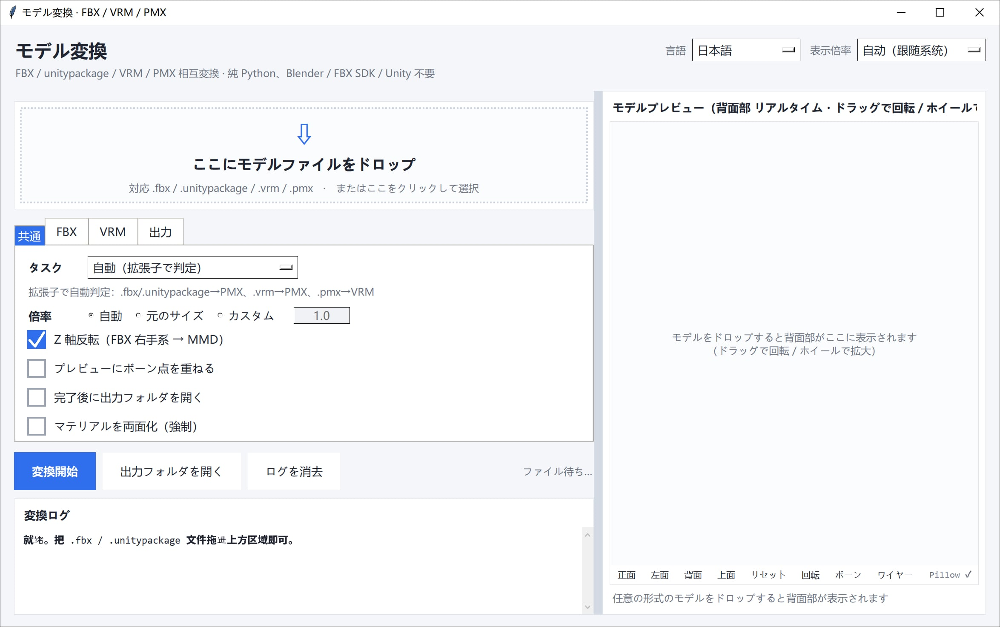

# モデル変換ツール（純 Python）

`.fbx`・`.unitypackage`・`.vrm`・`.pmx`・`.uemodel`（UEFormat）を相互に変換し、さらに `.psk` / `.pskx`（Unreal ActorX）を PMX へ変換できます。**すべて Python 標準ライブラリだけで実装**しています。
Blender / Autodesk FBX SDK / Unity 3D は不要、mmd_tools / UniVRM といったプラグインも不要です。
バイナリ形式を直接読み書きし、ウィンドウへドラッグするだけで変換できます。

[English](README.md) | [简体中文](README_SC.md) | [繁體中文](README_TC.md) | [日本語](README_JP.md)


---

## ダウンロード

最新バージョンは [releases](https://github.com/SaraKale/Model-to-PMX/releases/latest) からダウンロードしてください。

## 一、機能特徴

### 対応している変換方向

| 方向 | 説明 |
|---|---|
| FBX / unitypackage → PMX | MMD 用 PMX 2.0、四角面は自動的にファン三角形化 |
| VRM（0.x / 1.0） → PMX | humanoid ボーンを自動認識し、不足分はプレースホルダー骨で補完 |
| PMX → VRM（0.x / 1.0） | VRM メタ・humanoid ボーン映射・morph target を自動書き込み |
| uemodel（UEFormat） → PMX | 公開仕様 UEFormat の `.uemodel`（v1–v10）を読み込み。同じ実行で ASCII FBX も書き出し可能 |
| PMX → uemodel（UEFormat） | UEFormat `.uemodel`（既定 v9、v10 も指定可）を書き出し。UE / FModel エコシステムへ |
| PSK / PSKX（Unreal ActorX） → PMX | Unreal の `.psk`（`FACE0000`）/ `.pskx`（`FACE3200`）を読み込み。頂点ウェイト・MRPH 頂点モーフ・追加 UV に対応 |
| PMX → FBX | ASCII FBX 7.4 を書き出し（ボーン・ウェイト・BlendShape・相対テクスチャパス） |
| PMX → psk / pskx | Unreal ActorX 形式を書き出し；`.pskx` は法線/頂点色/追加 UV/表情付き、`.psk` は標準チャンクのみ |
| PMX → 検証 + プレビューのみ | 構造の読み取り専用検証、ファイルは出力しない |

### コア機能

- **外部依存ゼロ**：純 Python 標準ライブラリ（tkinter + ctypes）。`Pillow` は任意の高速化項目で、
  なくてもテクスチャのデコード速度と一部プレビューにしか影響せず、メインフローには影響しません。
- **ドラッグ＆ドロップで即利用**：Windows ネイティブの `WM_DROPFILES` を使用。ウィンドウ内のどこにでもドロップでき、
  tkinterdnd2 のようなサードパーティ製ライブラリは不要です。
- **選択ファイル一覧**：ドロップ後、ドロップ領域の下に ファイル名 / 形式 / サイズ と合計サイズが並びます。
  追加ドロップで**追記**（同一パスは自動で除外）、行を選んで削除、ダブルクリックでそのファイルだけをプレビュー。
  **このバッチで何を変換するのかが一目で分かり**、「変換開始」を押すまで実行されません。
- **リアルタイム正面プレビュー**：モデルをドラッグすると即座に 3D 正面図が表示され、ドラッグで回転 / ホイールで拡縮、
  ボーン点を重ねて位置合わせを確認できます（ツールバーの 正面 / 左面 / 背面 / 上面 は
  **「モデルのどちら側を見るか」**で命名しています）。
- **Toon は一切適用しません**：どの変換方向でも、書き出す PMX の材質は `toon_flag=0` + `toon=-1`、
  つまり MMD でいう「不使用 toon」になります。
- **多言語 UI**：右上で 简体中文 / 繁體中文 / English / 日本語 を切り替えられ、選択は設定に記憶されます。
- **高解像度ディスプレイ対応**：システム DPI に自動追従。右上の「界面缩放（UI 拡縮）」で倍率を手動指定も可。
- **タブ式オプション**：オプション欄は「通用 / FBX / VRM / UE / 出力」の 5 タブに分かれ、拡張しやすいです。
- **巻き順の自動判定**：三角形の巻き順を「幾何面法線 vs 頂点法線」の投票で自動判定し、
  大面積の抜け / 輪郭線が黒い塊になるのを防ぎます。
- **テクスチャ処理**：PNG/JPEG はそのまま透過、BMP/TGA はその場で PNG に変換、GLB へ埋め込むか PMX と同じフォルダへ書き出し。
- **PSK / PSKX を直接読み込み**：Unreal ActorX の `.psk`（`FACE0000`）と `.pskx`（`FACE3200`）の両方に対応し、
  頂点ウェイト・MRPH 頂点モーフ・`EXTRAUVS*` 追加 UV も引き継ぎます。Bip001（3ds Max Biped）の
  ボーン名は MMD 標準の日本語ボーン名（`センター` / `上半身` / `左足ＩＫ` …）へ自動対応付けし、
  **元の英語名はボーンの英語名フィールドに残す**ので、どちらも失われません。

---

## 二、環境要件

- **Windows**（ドラッグ＆ドロップと GUI は Windows ネイティブ API に依存）
- **Python 3.10+**（3.12 / 3.13 / 3.14 推奨、tkinter 同梱が必要）
- **任意**：`Pillow`（テクスチャのデコードとプレビューを高速化）

---

## 三、ディレクトリ構成

```
Model-to-PMX/
├── main.py                      # ★ グラフィカル UI の入口（完全実装）
├── main.spec                    # ★ PyInstaller のパッケージ設定
├── config.json                  # UI 設定（言語 / 拡縮 / オプション等）
│
├── formats/                     # フォーマット読み書き / 解凍
│   ├── fbx_reader.py            #   バイナリ FBX 7.x 解析ライブラリ
│   ├── fbx_probe.py             #   FBX 構造の調査（メッシュ/ボーン/スキン一覧）
│   ├── pmxio.py                 #   完全な PMX 2.0 読み書き（表情/IK/付与/剛体/ジョイント含む）
│   ├── vrmio.py                 #   GLB/glTF コンテナ読み書き + PNG エンコード + BMP/TGA デコード
│   ├── uemodelio.py             #   UEFormat .uemodel の読み書き（v1–v10）
│   ├── pskio.py                 #   Unreal ActorX .psk / .pskx の読み込み
│   ├── fbxout.py                #   ASCII FBX 7.4 ライタ（「FBX も同時出力」用）
│   └── unitypackage_unpack.py   #   .unitypackage の解凍（gzip tar）
│
├── convert/                     # 変換エンジン
│   ├── fbx2pmx.py               #   FBX → PMX
│   ├── vrm2pmx.py               #   VRM → PMX
│   ├── pmx2vrm.py               #   PMX → VRM
│   ├── uemodel2pmx.py           #   uemodel（UEFormat）→ PMX（FBX 同時出力可）
│   ├── pmx2uemodel.py           #   PMX → uemodel（UEFormat）
│   ├── pmx2psk.py               #   PMX → psk / pskx（Unreal ActorX）
│   ├── psk2pmx.py               #   PSK / PSKX（Unreal ActorX）→ PMX
│   └── pmx_check.py             #   PMX 検証 + ソフトウェア描画のプレビュー画像
│
├── gfx/
│   └── preview.py               # リアルタイム 3D 正面プレビュー部品
│
```

> エンジン・モジュールは役割ごとに `formats/` `convert/` `gfx/` サブディレクトリにまとめられており、実行時に `main.py` が
> この 3 ディレクトリを `sys.path` に挿入するため、モジュール間は依然として裸名の `import`（例：`import fbx2pmx`）を使っています。

---

## 四、使い方

### 方法 1：グラフィカル UI（推奨）

1. 実行：`python main.py`
2. `.fbx` / `.unitypackage` / `.vrm` / `.pmx` / `.uemodel` / `.psk` / `.pskx` ファイルを**ウィンドウ内の任意の場所へドラッグ**、またはドロップ領域をクリックしてファイルを選択。
   **ドロップでは読み込みとプレビューのみ行い、自動変換はしません**。タスク方向とオプションを確認し、「変換開始」を押すと実行されます。
3. ドロップ領域の下に**選択ファイル一覧**（ファイル名 / 形式 / サイズ）が表示され、今回変換する内容が一目で分かります：
   - 追加ドロップは**追記**（絶対パスで重複を自動除外）；
   - 行をダブルクリックするとそのファイルだけをプレビュー；
   - 行を選んで「選択を削除」（Delete キーでも可）、または「リストをクリア」でやり直し；
   - リストにファイルがある間は、ドロップ領域が細い帯になって縦のスペースをリストに譲ります。
4. 「タスク」ドロップダウンで変換方向を手動指定可能。既定は拡張子から自動判定。タスクを切り替えると、読み込み済みファイルは新しい方向で再抽出されます（一覧も更新）。
5. 変換ログは左下、モデルプレビューは右の全高カラム。

UI のポイント：

- **左右分割**：Blender のエリアのように中央の仕切りをドラッグして幅を変更でき、位置は `config.json` に保存されます
- **右カラム全体がプレビュー**：正面のリアルタイム表示。下のツールバーは 正面 / 左面 / 背面 / 上面 / リセット / 回転 / ボーン / ワイヤー。
  4 つの視点ボタンは**「モデルのどちら側を見るか」**で命名しています：正面 = 顔が見える（カメラが `-Z`、これが MMD の正面）、
  背面 = 背中が見える（カメラが `+Z`）、左面 = モデルの左側が見える（カメラが `+X`。MMD では `+X` がモデルの左手側）、
  上面 = 真上から見下ろす
- **プレビュー右下の描画バックエンド表示**：`Pillow` か純 Python か、および前フレームの所要時間（ms）
- **右上「言語」**：简体中文 / 繁體中文 / English / 日本語（プレビューのツールバーも追従）
- **右上「界面缩放（UI 拡縮）」**：システム DPI に自動追従、または倍率を手動指定
- **オプションタブ**：「通用 / FBX / VRM / UE / 出力」の 5 タブ
- **UE タブ**：タスクで「uemodel → PMX」を選んだとき、「同時に FBX を出力」にチェックすると PMX の隣に ASCII FBX も書き出します。このタブでは目標身長（cm）とアルファの扱いも設定できます
- **FBX タブ**：3 つの設定項目があります。変更するとプレビューと「変換開始」の結果の両方にすぐ反映されます
  - **テクスチャのアルファ**：`保持`（そのまま）/ `自動判定（推奨）`/ `すべて除去`。
    MMD はテクスチャのアルファをそのまま材質の透明度として扱いますが、ゲーム用テクスチャはアルファを発光・ハイライトのマスクとして流用していることが多く、
    その手のマスクは除去しないとモデル全体が半透明になったりゴーストが出たりします。逆に本当の透明は残さないと、レース・ベール・毛先が硬いエッジに削られてしまいます。
    `自動判定` は、そのテクスチャが実際に使っている UV 領域をサンプリング（最大 4000 点）して「ほぼ全透明が 75% 以上 **かつ** 不透明が 5% 以下」かを調べ、
    さらに画像全体の統計と相互確認します。両方が一致したときだけマスクと判定し、アルファ抜きのコピー `<名>_noalpha.png` を書き出して
    **材質の参照先だけを差し替えます。元のテクスチャファイルは 1 バイトも書き換えません**。
  - **向きの自動判定**：FBX には「モデルがどちらを向いているか」の情報がありません。右手系→左手系の変換には 1 軸の反転が必要で、
    どの軸を反転するかで、変換後にカメラに対して前向きになるか後ろ向きになるかが決まります。
    オンにすると**つま先の向き**（toe 系ボーンの親からの変位の合計。`|x| << |z|` のときだけ採用）→ だめなら**顔メッシュの重心**
    （顔 / 頭 / 目 / 口 / 眉 系メッシュの加重中心と全身中心のズレ）の 2 段構えで判定し、結果と根拠をログに出します。
  - **180° 強制追加**：判定結果の上にさらに Y 軸 180° を追加します。自動判定が両方とも決め手を掴めなかった場合や、
    あえて後ろ向きにしたい場合だけ使ってください。
  - （常時有効）**マテリアルが 1 つも割り当てられていないメッシュは読み飛ばします**。ゲーム（Unity / HoYo 系）の書き出しには
    `EffectMesh` という名のエフェクト板が紛れていることが多く、これはマテリアルノードもテクスチャも持たず、UV がアトラス全体に広がり、
    幾何は全身をまたぐ薄い板です。通常メッシュとして出力すると MMD では不透明な灰色の板がスカートの上に被さり、
    「テクスチャが反転した」ように見えますが、実際には UV は正しく、単に下地が隠されているだけです。
    ログには `skip <メッシュ名> tris=<n> (no material / effect sheet)` が出ます。
- **書き出した FBX のテクスチャ**：FBX は UV の **V 軸を反転**して書き出します（PMX/MMD は UV 原点が左上、FBX / Blender / Maya は左下）。テクスチャは相対パス `textures/…` で参照するので、FBX は PMX の隣に置き `textures` フォルダも一緒に持って行ってください。そうしないと「形は合っているのに模様が全体的にズレる」見え方になります
- **チェックボックス拡大**：チェック枠とクリック領域が押しやすくなっています

### 重いモデルでもプレビューが軽い理由

リアルタイムプレビューは OpenGL を使わない純 Python のソフトウェア・ラスタライザなので、
3 つの仕組みで滑らかさを保っています。

1. **ドラッグ中は間引きメッシュ** —— 操作中は約 12,000 面に間引いて描画。
   90k 面のモデルでも 1 フレーム約 40ms；
2. **手を止めたら分割リファイン** —— 本描画は 1 スライス 1500 面ずつ、
   1 回あたり最大 24ms に制限して進めるため、UI が固まらず絵が少しずつ精細になります；
3. **ピクセル予算の自動調整** —— 実測フレーム時間に応じて解像度を上下させ、
   Pillow があれば低解像度の結果をキャンバスサイズへ拡大する処理を C 側で行います。

### 方法 2：コマンドライン

> スペースや日本語を含むパスは必ず二重引用符で囲むこと。エンジン・スクリプトは `convert/` `formats/` サブディレクトリにあります。

```powershell
# グラフィカル UI を開く
python main.py

# FBX → PMX
python convert/fbx2pmx.py "model.fbx" -o "model.pmx"

# FBX → PMX：アルファのモード指定 / 向き判定オフ / 180° 強制追加
python convert/fbx2pmx.py "model.fbx" -o "model.pmx" --alpha auto
python convert/fbx2pmx.py "model.fbx" -o "model.pmx" --alpha strip
python convert/fbx2pmx.py "model.fbx" -o "model.pmx" --no-auto-facing --face-180

# unitypackage の解凍（--list は内容のみ一覧表示して解凍しない）
python formats/unitypackage_unpack.py "pack.unitypackage" --list
python formats/unitypackage_unpack.py "pack.unitypackage"

# FBX 構造の調査
python formats/fbx_probe.py "model.fbx"

# PMX → VRM 1.0（既定）/ 0.x
python convert/pmx2vrm.py "model.pmx" -o "model.vrm"
python convert/pmx2vrm.py "model.pmx" --spec 0x --title "名前" --author "作者"

# VRM → PMX（テクスチャは PMX と同じフォルダへ自動書き出し）
python convert/vrm2pmx.py "model.vrm" -o "model.pmx"

# uemodel（UEFormat）→ PMX；--fbx を付けると PMX の隣に ASCII FBX も出力
python convert/uemodel2pmx.py "model.uemodel" -o "model.pmx"
python convert/uemodel2pmx.py "model.uemodel" -o "model.pmx" --fbx

# PMX → uemodel（既定は UEFormat v9；--version 10 で新しいバイト配置）
python convert/pmx2uemodel.py "model.pmx" -o "model.uemodel"
python convert/pmx2uemodel.py "model.pmx" -o "model.uemodel" --version 10

# PSK / PSKX（Unreal ActorX）→ PMX
# ボーン名は既定で MMD 標準の日本語名に変換（元の英語名は英語名フィールドへ）
# テクスチャは材質名からソースフォルダ内を自動検索
python convert/psk2pmx.py "model.psk" -o "model.pmx"
python convert/psk2pmx.py "model.pskx" -o "model.pmx" --raw-bone-names --no-ik

# PMX → FBX（ASCII 7.4、ボーン/ウェイト/BlendShape/相対テクスチャパス）
python convert/fbxout.py "model.pmx" -o "model.fbx"

# PMX → pskx（既定 pskx、法線/追加 UV/表情付き；既定目標身長 160cm）
python convert/pmx2psk.py "model.pmx" -o "model.pskx"

# PMX → psk（標準チャンクのみ、法線/表情なし）
python convert/pmx2psk.py "model.pmx" -o "model.psk" --std

# PMX 検証 + プレビュー画像生成
python convert/pmx_check.py "model.pmx"
python convert/pmx_check.py "model.pmx" --bones   # ボーン位置を重ねる

# PMX のテキストエンコードを MMD が読める UTF-16LE に変更（旧ファイルの修復用）
python formats/pmxio.py "model.pmx"               # model_utf16.pmx を出力
python formats/pmxio.py "model.pmx" --in-place    # 上書き（事前にバックアップ推奨）
```

#### よく使うオプション早見表

`fbx2pmx.py`：

| オプション | 説明 |
|---|---|
| `--scale mmd` | 既定。MMD 標準身長（約 20 単位）へ自動スケーリング |
| `--scale raw` | FBX の元のサイズ（メートル）を維持 |
| `--scale 12.5` | 倍率を手動指定 |
| `--no-flip-z` | 右手系→左手系の変換を行わない（既定では変換する） |
| `--alpha keep\|auto\|strip` | テクスチャのアルファ処理。既定は `auto`（下記参照） |
| `--remove-alpha` | 旧オプション。`--alpha auto` と同義（互換のため残存） |
| `--no-auto-facing` | 向きの自動判定を無効化し、既定の 1 軸反転（Z）を使う |
| `--face-180` | 判定結果の上にさらに 180° を強制追加する |
| `--keep-untextured-meshes` | マテリアル無しメッシュを残す（既定では読み飛ばし。下記「エフェクト板」参照） |
| `--info` | 構造情報のみ表示し、変換は行わない |

`--alpha` の 3 モード：

| モード | 動作 |
|---|---|
| `keep` | アルファを一切変更せず、元テクスチャをそのまま参照 |
| `auto`（既定） | 1 枚ごとに判定。マスクと判定されたものだけアルファ抜きコピー `<名>_noalpha.png` を作って参照先を差し替え、本当の半透明／完全不透明はそのまま保持 |
| `strip` | アルファチャンネルがあれば無条件に除去（旧版の動作） |

自動判定の閾値（`PEPlugins-FBXimport` プラグインと同一）：アルファ < 8 を「透明」、> 250 を「不透明」として数え、
UV 領域のサンプリング（最大 4000 点）と画像全体の統計が互いに裏付ける必要があり、**透明 ≥75% かつ不透明 ≤5%** でマスクと判定します。
UV が取れない場合は画像全体の 90% / 1% にフォールバック。判定の明細（テクスチャ名 → strip / keep ＋ 透明・不透明の割合）はログに出力されます。

`pmx2vrm.py`：`--spec 1.0|0x`、`--scale auto|倍率`、`--rotate auto|none|y180`、
`--flip-winding`、`--force-double-sided`、`--max-morphs N`、`--title` / `--author`。

`vrm2pmx.py`：`--scale`、`--rotate`、`--flip-winding`、`--edge`（輪郭線を有効化）、
`--force-double-sided`、`--name`。

`psk2pmx.py`：

| オプション | 説明 |
|---|---|
| `--scale mmd` | 既定。バウンディングボックスの高さを MMD 標準の 20 単位に正規化 |
| `--scale 0.14` | 倍率を手動指定 |
| `--edge` | 材質の MMD 輪郭線を有効化（既定はオフ） |
| `--force-double-sided` | 材質を強制的に両面描画（薄い髪・スカートでよく使う） |
| `--no-textures` | テクスチャを探さず、白モデルとして出力 |
| `--keep-alpha` | テクスチャの alpha を保持（既定では材質ごとに alpha を除去） |
| `--no-add-uv` | `EXTRAUVS*` 追加 UV を破棄 |
| `--raw-bone-names` | ボーン名を元の英語名のまま保持（既定は MMD 日本語標準名へ変換し、原名を英語名フィールドに残す） |
| `--no-ik` | MMD の足 IK ボーンを補完しない（既定では脚の骨チェーンが揃っていれば `左足ＩＫ` / `左つま先ＩＫ` を追加） |
| `--no-morphs` | 表情を出力しない（既定では MRPH の頂点変位を PMX 頂点モーフへ変換） |
| `--fbx` | PMX の隣に ASCII FBX も書き出す |
| `--name` | モデル名を指定 |

より詳しいオプションとフォーマット映射については `FBX转PMX_使用说明.md` と `VRM互转_使用说明.md` を参照してください。

---

## 五、ビルドとパッケージ化

### 1. PyInstaller のインストール

```powershell
pip install pyinstaller
pip install pillow          # 任意。同梱するビルドにもテクスチャ高速化を効かせる
```

### 2. spec を使ったビルド（推奨）

> **必ず spec を使うこと**。直接 `pyinstaller main.py` はしないでください。

```powershell
pyinstaller main.spec
```

成果物：`dist/ModelConvert.exe/ModelConvert.exe`（one-folder モード）。

### 3. なぜ spec が必須か

エンジン・モジュールは `formats/` `convert/` `gfx/` サブディレクトリにまとめられており、`main.py` 内では
`import fbx2pmx` のような裸名 import を使っています。サブディレクトリが `sys.path` に加わるのは**実行時**です。
**PyInstaller は静的解析しか行わず、実行時のパス注入を見ることができません**——`pathex` にこれらの
サブディレクトリがなければ、ビルド段階で「見つからないモジュール」として破棄されます。ビルドは成功しますが、実行すると次のエラーになります：

```
ModuleNotFoundError: No module named 'fbx2pmx'
```

`main.spec` にはすでに正しく設定されています：

```python
Analysis(
    ['main.py'],
    pathex=['.', 'formats', 'convert', 'gfx'],     # 静的解析でサブディレクトリのモジュールを見つける
    hiddenimports=['fbx2pmx', 'pmx_check', 'pmx2vrm', 'vrm2pmx', 'preview',
                   'unitypackage_unpack', 'fbx_reader', 'pmxio', 'vrmio'],
    ...
)
```

spec を使わない場合の同等の書き方：

```powershell
pyinstaller --paths formats --paths convert --paths gfx -w main.py
```

### 4. よく使うオプション

| オプション | 説明 |
|---|---|
| `-F` | 単一の実行ファイルにパッケージ化 |
| `-D` | 複数ファイルを含むフォルダにパッケージ化（既定） |
| `-w` | コンソールウィンドウを非表示（GUI アプリ） |
| `-i icon.ico` | 実行ファイルのアイコンを指定 |
| `-n 名前` | 生成する実行ファイル名を指定 |
| `--add-data "元:先"` | リソースファイルを追加 |
| `--hidden-import モジュール名` | 隠し依存を手動で補完 |

---

## 六、注意事項

### 共通

1. **スペース / 日本語を含むパス**：コマンドライン呼び出し時は必ず二重引用符で囲む。
2. **設定ファイル `config.json`**：言語・UI 拡縮・タスク方向・各オプションなどを記録。削除すると既定値で再作成される。
1. **ショートカットと操作**：プレビュー欄はドラッグで回転、ホイールで拡縮。ドロップ領域をクリックでファイル選択ダイアログを開く。

### モデルが真っ黒 / 黒い縁 / 抜けがある

- **変換後モデルに黒い線が入る**：本ツールはデフォルトで PMX 出力時に MMD の輪郭線を無効化します（頂点 edge=0、材質 edge_size=0、edge_color alpha=0）。それでも黒い縁が残る場合は、MMD / PMXEditor で全材質を選択し**輪郭線をオフ**にし、さらに**「両面描画」**にチェックを入れる。
- **それでも抜けがある**：まずログの `绕序自动判定`（巻き順自動判定）の行を見る。判定が誤っているなら `--flip-winding` を追加。薄い幾何（髪 / スカート）が両面描画に依存する場合は `--force-double-sided` を追加、あるいは UI の「材质强制双面（材質の両面化を強制）」にチェック。

### モデルがカメラに背を向ける / 向きが違う

- FBX には「正面がどちらか」の情報がないため、どんな推測でも 100% 当たるわけではありません。FBX タブの**「向きの自動判定」**（既定でオン）を使うと、
  **つま先の向き** → だめなら**顔メッシュの重心**の順で判定し、結果と根拠をログに出します（`自动判定朝向：面朝 +Z（依据：脚尖）`）。
- どちらの手掛かりも得られない場合（ボーン名が規格外で、顔メッシュも識別できない）は既定の反転にフォールバックします。
  その結果 MMD でモデルが**カメラに背を向ける**ときは、**「180° 強制追加」**（コマンドライン `--face-180`）にチェックを入れてください。
  これは X と Z を同時に反転する（＝ Y 軸回りに半回転）だけなので、頂点数・面数・ボーン数、そして巻き順の自動判定には影響しません。
- 判定そのものが外れる場合は、`--no-auto-facing` で判定を無効化し `--face-180` と組み合わせて手動調整します。
  プラグインの `AutoDetectFacing=false` + `Rot180Y=true` と同じ状態です。
- **PSK / PSKX はこの影響を受けません**：Unreal の PSK 形式は軸の取り決めが明確（`-Y` が正面）なので、
  軸の入れ替えは固定の 1 回の反転で済み、判定は不要です。もし手元の PSK が背を向けて出力される場合は、
  ソースの軸の取り決めが標準と異なるので、PMXEditor で Y 軸回りに 180° 回転してください。

### 透明であるべきでない所が透ける / 透明であるべき所が不透明

- **モデル全体が半透明になりゴーストが出る**：テクスチャのアルファが発光・ハイライトのマスクとして使われている典型例です。
  `--alpha strip`（UI なら「すべて除去」）を使ってください。普段は既定の `auto` のままで十分で、
  マスクと判定されたものだけを処理します。
- **レース / ベール / 毛先が硬いエッジに削られた**：本当の透明まで削ってしまった状態です。`auto` に戻すか `keep` を選んでください。
- どのモードでも**元のテクスチャファイル自体は変更されません**。アルファ抜きの結果は `<名>_noalpha.png` というコピーに書き出され、
  材質の参照先だけが差し替えられます。
- ログの `贴图透明通道`（テクスチャのアルファ）ブロックには、各テクスチャが「名前 → 除去 / 保持（透明 x%、不透明 y%）」の形で並びます。迷ったらここを見てください。

### 灰色の板が被さる / 「UV が反転した」ように見える

- まず UV を疑わないでください。ゲーム（Unity / HoYo 系）の FBX には `EffectMesh` が紛れていることが多く、
  これは**マテリアルノードもテクスチャも持たず**、UV がアトラス全面に広がり、幾何は全身をまたぐ薄い板です。
  通常メッシュとして出力されるとスカートの真上に不透明な灰色の板が乗るため、
  「テクスチャが上下反転した」のとほとんど見分けがつきませんが、UV は正しいままです。
- 本ツールは**マテリアルが 1 つも無いメッシュを既定で読み飛ばし**、
  ログに `skip <メッシュ名> tris=<n> (no material / effect sheet)` を出します。まずこの行の有無を確認してください。
- どうしてもそのメッシュが必要な場合は `--keep-untextured-meshes` を付けてください（UI にはトグルがなく、コマンドラインのみ）。

### 既知の制限

- **FBX 構造**：バイナリ FBX 7.x と ASCII FBX の **両方に対応**（以前の「ASCII 非対応」は誤りでした）。
- **テクスチャ形式**：DDS / KTX2 / WebP はスキップされる（材質は単色に退化）。
- **物理**：PMX 剛体/ジョイント ↔ VRM SpringBone は**相互変換されない**。
- **材質効果**：球環境マップ（.sph/.spa）・toon マップは VRM 側に保持されない。逆方向（→ PMX）では本ツールは一切 toon を適用しません。
- **ボーン名**：FBX 変換は英語ボーン名（`Hips`、`Spine` …）を維持するため、MMD の既存モーション（.vmd）と一致せず、PMXEditor で日本語標準名へ一括変更が必要。
  PSK は別ルートです。Bip001（3ds Max Biped）の命名は**既定で MMD 標準の日本語名に変換**され、元の英語名はボーンの英語名フィールドに残ります。
- **表情**：ソースモデルに BlendShape / morph がない場合、PMX の表情も 0 となり、手作業での作成が必要。
- **PSK / PSKX 双方向の既知の制約**：
  - PMX→psk では日本語ボーン名は `name_en` を優先的に使用し、ない場合はフォールバック表
    （`全ての親` → `Root` など）を参照し、それもなければ `bone%03d` になります。
  - PMX の IK / 付与 / 剛体 / Joint / UV モーフ / マテリアルモーフは PSK に対応する構造が
    ないためスキップされます（ログで件数を出力）。
  - PMX は頂点あたり最大 4 本のボーンウェイトです。元の PSK が 5～6 本ある場合、
    往復で失われます（実測：Aimisi は 177880 → 176071 本）。
- **PSK の座標系は固定マッピング**：Unreal の PSK は「`+X` 左手・`-Y` 正面・`+Z` 上」、PMX は
  「`+X` 左手・`-Z` 正面・`+Y` 上」で、右手系と左手系が逆です。そのため軸の入れ替えには**1 回の反転**が必要で、
  本ツールは `(x, y, z) → (x, z, y)` を使っています。これは固定で、FBX のような「向きの自動判定」スイッチはありません。
- **`.psk` の拡張子衝突**：PmxEditor は「アンカーデータ」を `.psk` で保存するため、Unreal のメッシュと同じ拡張子になります。
  詳しくは後述の「PmxEditor が『アンカーデータの読み込みに失敗しました』と表示する」を参照してください。

### MMD がモデルを読み込めない（エンコード）

MMD が読み込める PMX は**テキストエンコードが UTF-16LE のものだけ**です。本家のメッセージは
`MMDではエンコード方式がUTF16のPMXファイルしか読み込めません`
（同梱の英文：`MMD can't read UTF8 encorded PMX. Please exchange it to UTF16.`）。
中国語版は「MMD不能载入编码为UTF16的PMX文件」と訳されていますが、**意味が逆になる誤訳**です。
この表示が出たときの本当の原因は、ファイルが UTF-8 で保存されていることです。

本ツールの出力は常に UTF-16LE です。旧版で書き出したファイルは
`python formats/pmxio.py "old.pmx"` で修復できます。検証ログにも
`文本编码是 UTF-8，MMD 无法载入（需要 UTF-16LE）` と表示されます。

### PmxEditor が「アンカーデータの読み込みに失敗しました。」と表示する（OK を押せばモデルは表示される）

**これは MMD のエラーではなく、PmxEditor のものです。** しかも PMX ファイル自体とは関係ありません。

PmxEditor には「アンカー」機能があり、空間領域ごとにボーンと頂点のウェイト関係を一括設定できます。
そのデータは **PMX の中には格納できず**、別途 `*.psk` ファイル（PmxEditor では「PMX スケルトン」）として保存されます。
モデルを開くとき、PmxEditor は**モデルと同名**の `.psk` を探して自動的に読み込みます —— メニューの
`[ファイル] → [アンカーデータの自動読み込み／保存]` がこれです。readme の記述：

> `[アンカーデータの自動読み込み／保存]` - モデルファイル名と同名のアンカーデータファイル(\*.psk)がある場合自動読み込み

問題は、**`.psk` が Unreal ActorX メッシュの拡張子でもある**ことです。つまり本ツールの入力形式です。
そのため `R2T1FeiBiMd10011.psk` を `R2T1FeiBiMd10011.pmx` へ変換するという最も自然な命名で、
PmxEditor がその Unreal メッシュを自分のアンカーデータとして解析しようとし、当然失敗してこのメッセージが出ます。

**影響：ありません。** OK を押すと PmxEditor はアンカーデータを読み飛ばすだけで、モデルは通常どおり読み込まれます。
表示を完全に止めたい場合：

1. 出力した PMX を別のフォルダへ移す、または名前を変える（`xxx.psk` の隣に `xxx.pmx` を置かなければよい）；
2. PmxEditor の `[ファイル] → [アンカーデータの自動読み込み／保存]` をオフにする。

本ツールは、出力 PMX の隣に同名の `.psk` / `.pskx` がある場合、変換時にログでその旨を通知します。

### Toon について

本ツールが書き出す PMX は、どの変換方向でも **Toon を使用しません**。材質は
`toon_flag=0` + `toon=-1` で書き出され、PMXEditor / MMD では「なし」と表示されます。

⚠️ ついでに、間違えやすいポイントを記録しておきます。PMX 材質の toon フィールドの幅は
「共有Toonフラグ」で決まり、2 つの向きを逆にしがちです：

| flag | 意味 | フィールド |
|---|---|---|
| `1` | 共有 / 内蔵 toon | **1 バイトの番号**。MMD のインストール先 `Data/` にある `toon01.bmp` … `toon10.bmp` を参照し、**番号 0 が `toon01.bmp`** |
| `0` | このモデルのテクスチャテーブル内の画像 | テクスチャインデックス幅で、**`-1` = なし（不使用）** |

「番号 0 = `toon00.bmp` = Toon 不使用」は広く流布した誤解です —— **MMD の `Data/` には
`toon00.bmp` がそもそも存在しません**（あるのは `toon01` … `toon10` のみ）。mmd_tools のソースにも
`toon%02d.bmp % (shared + 1)` とハードコードされています。したがって `flag=1, toon=0` は
すべての材質に `toon01.bmp` を無理やり適用しているのと同じです。
本ツールの 2026-09-24 より前のバージョンがまさにこの書き方で、現在は `flag=0, toon=-1` に修正済みです。

### ドラッグ＆ドロップ関連

- ドラッグ＆ドロップは Windows ネイティブの `WM_DROPFILES` に依存し、**Windows でのみ利用可能**。他 OS では「参照」ボタンでファイルを選択してください。
- ログに「系统未启用拖放接口（ドラッグ＆ドロップ接口が有効化されていません）」と表示された場合、現在の環境はネイティブなドラッグ＆ドロップに対応していません。ボタンからの選択に切り替えてください。

### パッケージ化関連

1. **`pyinstaller main.spec` を使うこと**（または `--paths` 付きの同等コマンド）。さもないとサブディレクトリ内のエンジン・モジュールが漏れ、実行時に `No module named 'fbx2pmx'` となる。
1. **ソースを変更したら再ビルドが必要**。古い exe をダブルクリックしても反映されない。
2. パッケージ化環境の Python には tkinter が含まれている必要がある（Windows 公式インストーラーは既定で含む）。

---

## 七、著作権の注意

VRM の meta にはライセンス情報が含まれます。本ツールは最も保守的な「表示（帰属）必須・再配布禁止・改変禁止」を既定で書き込みます。

**変換前に、そのモデルを利用する権利があるか自身で確認してください**。本ツールは著作権チェックを行いません。
