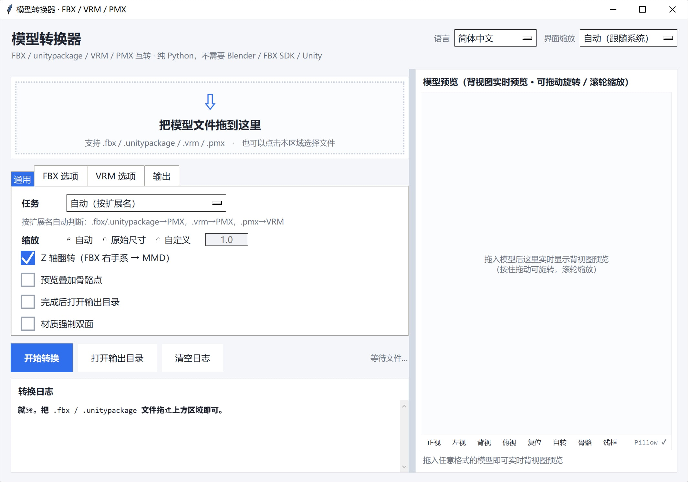

# 模型转换器（纯 Python）

把 `.fbx`、`.unitypackage`、`.vrm`、`.pmx`、`.uemodel`（UEFormat）互相转换，并能把 `.psk` / `.pskx`（Unreal ActorX）转成 PMX，**全部用 Python 标准库实现**。
不需要 Blender / Autodesk FBX SDK / Unity 3D，也不需要 mmd_tools / UniVRM 等插件。直接读写二进制格式，拖进窗口即可转换。

[English](README.md) | [简体中文](README_SC.md) | [繁體中文](README_TC.md) | [日本語](README_JP.md)


---

## 下载

请从 [releases](https://github.com/SaraKale/Model-to-PMX/releases/latest) 下载最新版本。

## 一、功能特点

### 支持的转换方向

| 方向 | 说明 |
|---|---|
| FBX / unitypackage → PMX | MMD 用 PMX 2.0，四边形自动扇形三角化 |
| VRM（0.x / 1.0） → PMX | 自动识别 humanoid 骨骼，缺的补占位骨 |
| PMX → VRM（0.x / 1.0） | 自动写 VRM meta、humanoid 骨骼映射、morph target |
| uemodel（UEFormat） → PMX | 读公开的 UEFormat `.uemodel`（v1–v10）；可同时导出一份 ASCII FBX |
| PMX → uemodel（UEFormat） | 写出 UEFormat `.uemodel`（默认 v9，可选 v10），可交给 UE / FModel 生态 |
| PSK / PSKX（Unreal ActorX） → PMX | 读 Unreal 的 `.psk`（`FACE0000`）/ `.pskx`（`FACE3200`），带顶点权重、MRPH 顶点表情、附加 UV |
| PMX → FBX | 写出 ASCII FBX 7.4（含骨骼、权重、表情 Shape、贴图相对引用 textures/…） |
| PMX → psk / pskx | 写出 Unreal ActorX 格式（含法线/附加UV/表情等扩展块可选） |
| PMX → 仅校验 + 预览 | 只读结构校验，不输出文件 |

### 核心特性

- **零外部依赖**：纯 Python 标准库（tkinter + ctypes）。`Pillow` 为可选加速项，
  缺失只影响贴图解码速度与部分预览，不影响主流程。
- **拖放即用**：走 Windows 原生 `WM_DROPFILES`，窗口任意位置都能拖，无需
  tkinterdnd2 之类的第三方库。
- **待转文件列表**：拖入后拖放区下方列出 文件名 / 格式 / 大小 与总大小，可追加、
  单选移除、双击单独预览；**只看列表就知道这次要转什么**，不点「开始转换」不动手。
- **实时正面预览**：拖入模型即可看到 3D 正面预览，可拖动旋转 / 滚轮缩放，
  可叠加骨骼点检查对齐（工具条的 正视 / 左视 / 背视 / 俯视 按「看到模型哪一面」命名）。
- **一律不上 Toon**：所有方向写出的 PMX 材质都是 `toon_flag=0` + `toon=-1`，
  也就是 MMD 里的「不使用 toon」。
- **多语言界面**：右上角可切换 简体中文 / 繁體中文 / English / 日本語，选择记忆到配置。
- **高分屏友好**：按系统 DPI 自动缩放，右上角「界面缩放」可手动指定倍率。
- **输出到同名子文件夹**：默认创建 `<文件名>_<日期>_<序号>` 子目录（如 `R2T1AimisiMd10011_20260101_001`），重复转换不会覆盖旧文件；可在「输出」页签关闭。
- **分页式选项**：选项区按「通用 / FBX / VRM / UE / PSK / 输出」分为六个标签页，易于扩展。
- **自动绕序判定**：三角形绕序用「几何面法线 vs 顶点法线」投票自动判定，
  避免出现大面积镂空 / 轮廓线糊成黑块。
- **贴图处理**：PNG/JPEG 直接透传，BMP/TGA 现转 PNG，嵌入 GLB 或导出到 PMX 同目录。
- **PSK / PSKX 双向**：可以读也可以写。读时支持 `.psk`（`FACE0000`）与 `.pskx`
  （`FACE3200`），顶点权重、MRPH 顶点表情、`EXTRAUVS*` 附加 UV 一并带过来；
  写时可以选择标准 `.psk`（只含顶点/面/材质/骨骼/权重）或扩展 `.pskx`
  （再加法线、顶点色、附加 UV、表情）。Bip001 这套 3dsMax Biped 骨名自动映射成
  MMD 标准日文名（`センター` / `上半身` / `左足ＩＫ` …），
  **英文原名写进骨骼的英文名备注字段**，两边都不丢。
  反过来 PMX→psk 也做了日文名→英文名的兜底表（`全ての親` → `Root`、`センター` →
  `Center` …），转出去的骨骼名不会被改成乱码。

---

## 二、环境要求

- **Windows**（拖放与 GUI 依赖 Windows 原生 API）
- **Python 3.10+**（推荐 3.12 / 3.13 / 3.14，需自带 tkinter）
- **可选**：`Pillow`（加速贴图解码与预览）

---

## 三、目录结构

```
Model-to-PMX/
├── main.py                      # ★ 图形界面入口（完整实现）
├── main.spec                    # ★ PyInstaller 打包配置
├── config.json                  # 界面设置（语言 / 缩放 / 选项等）
│
├── formats/                     # 格式读写 / 解包
│   ├── fbx_reader.py            #   二进制 FBX 7.x 解析库
│   ├── fbx_probe.py             #   探查 FBX 结构（网格/骨骼/蒙皮清单）
│   ├── pmxio.py                 #   完整 PMX 2.0 读写（含表情/IK/付与/刚体/关节）
│   ├── vrmio.py                 #   GLB/glTF 容器读写 + PNG 编码 + BMP/TGA 解码
│   ├── uemodelio.py             #   UEFormat .uemodel 读写（v1–v10）
│   ├── pskio.py                 #   Unreal ActorX .psk / .pskx 读取
│   ├── fbxout.py                #   ASCII FBX 7.4 写出器（「同时导出 FBX」用）
│   └── unitypackage_unpack.py   #   解包 .unitypackage（gzip tar）
│
├── convert/                     # 转换引擎
│   ├── fbx2pmx.py               #   FBX → PMX
│   ├── vrm2pmx.py               #   VRM → PMX
│   ├── pmx2vrm.py               #   PMX → VRM
│   ├── uemodel2pmx.py           #   uemodel（UEFormat）→ PMX（可同时导出 FBX）
│   ├── pmx2uemodel.py           #   PMX → uemodel（UEFormat）
│   ├── pmx2psk.py               #   PMX → psk / pskx（Unreal ActorX）
│   ├── psk2pmx.py               #   PSK / PSKX（Unreal ActorX）→ PMX
│   └── pmx_check.py             #   PMX 校验 + 软件渲染预览图
│
├── gfx/
│   └── preview.py               # 实时 3D 正面预览控件
│
```

> 引擎模块已按职责归入 `formats/` `convert/` `gfx/` 子目录，运行时由 `main.py`
> 把这三个目录插入 `sys.path`，因此模块间仍用裸名 `import`（如 `import fbx2pmx`）。

---

## 四、使用方法

### 方式一：图形界面（推荐）

1. 输入运行 `python main.py`
2. 把 `.fbx` / `.unitypackage` / `.vrm` / `.pmx` / `.uemodel` / `.psk` / `.pskx` 文件**拖进窗口任意位置**，或点击拖放区选择文件。
   **拖入只会载入 + 出预览，不会自动转换**；确认任务方向和选项后，点「开始转换」才真正开跑。
3. 拖放区下方会出现**已选择的文件列表**（文件名 / 格式 / 大小），一眼就能看清这次要转哪些：
   - 继续拖入是**追加**到列表，重复的文件按绝对路径自动去重；
   - 双击列表里的某一行 → 单独预览那个文件；
   - 选中若干行点「移除选中」（或按 Delete），或点「清空列表」重新来过；
   - 列表里有文件时，拖放区会收成一条窄带，把竖向空间让给列表。
4. 「任务」下拉框可手动指定转换方向，默认按扩展名自动判断。切换任务后，已就绪的文件会按新方向重新筛选（列表同步刷新）。
5. 转换结果与日志在左下，模型预览是右栏整列。

界面要点：

- **左右分栏**：像 Blender 那样可以拖中间的分割条调整宽度，位置会记进 `config.json`
- **右栏整列预览**：正面实时预览，底部工具条有 正视 / 左视 / 背视 / 俯视 / 复位 / 自转 / 骨骼 / 线框。
  四个视角按钮按**「看到模型的哪一面」**命名：正视 = 看到脸（相机在 `-Z`，也就是 MMD 的正面）、
  背视 = 看到背部（相机在 `+Z`）、左视 = 看到模型左侧（相机在 `+X`，MMD 里 `+X` 是模型的左手侧）、
  俯视 = 从上方看
- **右下角渲染后端**：显示当前用的是 `Pillow` 还是纯 Python，以及上一帧耗时（毫秒）
- **右上角「语言」**：简体中文 / 繁體中文 / English / 日本語（预览工具条也跟着切）
- **右上角「界面缩放」**：自动跟随系统 DPI，或手动指定倍率
- **选项分页**：「通用 / FBX / VRM / UE / 输出」五个标签页
- **UE 选项页**：任务选「uemodel → PMX」时，勾上「同时导出 FBX 文件」就会在 PMX 旁边多写一份 ASCII FBX；这一页还管目标身高（cm）与透明通道处理
- **FBX 选项页**：管三件事，改完会立刻影响预览和「开始转换」的结果
  - **贴图透明通道**：`保留`（原样）/ `自动判定（推荐）`/ `全部去除`。
    MMD 把贴图 alpha 直接当材质透明度，而游戏贴图经常把 alpha 当发光/高光遮罩用——
    后者必须去掉，否则模型会整块半透或出现鬼影；前者必须保留，否则蕾丝、薄纱、头发梢会被削成硬边。
    `自动判定` 的做法是：按 UV 采样这张贴图真正用到的区域（最多 4000 点）统计「几乎全透占比 ≥75% 且实心占比 ≤5%」，
    再用整图统计互相印证，两条都成立才判定为遮罩 → 复制一份去 alpha 的 `<名>_noalpha.png`，**只在材质里改成引用副本，源贴图原图一个字节都不动**。
  - **自动判定朝向**：FBX 里没有「模型正面朝哪」这个字段，坐标转换要做一次单轴反射，反射哪个轴决定了模型最后是正对镜头还是背对。
    勾选后按**脚尖方向**（所有 toe 类骨骼相对父骨的位移和，`|x| << |z|` 才算数）→ 不行再用**脸部网格重心**（脸/头/目/口/眉类网格的加权中心与全身中心的偏移）两级判定，结果和判据都会写进日志。
  - **强制额外转 180°**：在上述结果之上再追加一次绕 Y 的 180°。只在自动判定搞不定（两个判据都拿不到）或你本来就想让模型背对镜头时用。
  - （固定行为）**没有挂任何材质的网格会被直接跳过**。游戏（Unity / 米哈游系）导出常带一张叫 `EffectMesh` 的效果片：没有材质节点、没有贴图，UV 铺满整张图集，几何是一片横跨全身的薄板。按普通网格导出去，在 MMD 里就是一块不透明的灰白大板压在裙子上，看着很像「贴图被翻错了」，其实是底色被盖住了。日志里会打印 `skip <网格名> tris=<n> (no material / effect sheet)`。
- **导出 FBX 的贴图**：写出的 FBX 会把 UV 的 **V 轴翻过来**（PMX/MMD 的 UV 原点在左上，FBX / Blender / Maya 在左下），贴图引用写成相对路径 `textures/…`。所以要把 FBX 放在 PMX 旁边、`textures` 文件夹一起带着，贴图才显示得出来；否则会看到「形状对、图案整体错位」的样子
- **复选项已加大**：勾选框与点击区域更易点击

### 预览为什么这么快（大模型也不卡）

实时预览是纯 Python 软光栅（没有 OpenGL），所以做了三层配合：

1. **拖动时用抽稀网格**：自动抽到约 1.2 万个面做交互帧，90k 面的模型一帧约 40ms；
2. **停手后分片精修**：精修图按每片 1500 个面推进，每个时间片最多占用 24ms，
   画面逐块变清晰，界面不会整块卡住；
3. **像素预算自适应**：按实测帧耗时自动升降渲染分辨率；装了 Pillow 还会用它
   把低分辨率结果放大到画布尺寸（C 实现）。

### 方式二：命令行

> 路径含空格或中文时务必加双引号；引擎脚本位于 `convert/` `formats/` 子目录。

```powershell
# 打开图形界面
python main.py

# FBX → PMX
python convert/fbx2pmx.py "model.fbx" -o "model.pmx"

# FBX → PMX：手动指定 alpha 三档 / 关掉朝向自动判定 / 强制多转 180°
python convert/fbx2pmx.py "model.fbx" -o "model.pmx" --alpha auto
python convert/fbx2pmx.py "model.fbx" -o "model.pmx" --alpha strip
python convert/fbx2pmx.py "model.fbx" -o "model.pmx" --no-auto-facing --face-180

# 解包 unitypackage（--list 只列内容不解包）
python formats/unitypackage_unpack.py "pack.unitypackage" --list
python formats/unitypackage_unpack.py "pack.unitypackage"

# 探查 FBX 结构
python formats/fbx_probe.py "model.fbx"

# PMX → VRM 1.0（默认）/ 0.x
python convert/pmx2vrm.py "model.pmx" -o "model.vrm"
python convert/pmx2vrm.py "model.pmx" --spec 0x --title "名字" --author "作者"

# VRM → PMX（贴图自动导出到 PMX 同目录）
python convert/vrm2pmx.py "model.vrm" -o "model.pmx"

# uemodel（UEFormat）→ PMX；加 --fbx 会在 PMX 旁边同时写一份 ASCII FBX
python convert/uemodel2pmx.py "model.uemodel" -o "model.pmx"
python convert/uemodel2pmx.py "model.uemodel" -o "model.pmx" --fbx

# PMX → uemodel（默认 UEFormat v9；--version 10 用新版字节布局）
python convert/pmx2uemodel.py "model.pmx" -o "model.uemodel"
python convert/pmx2uemodel.py "model.pmx" -o "model.uemodel" --version 10

# PSK / PSKX（Unreal ActorX）→ PMX
# 骨名默认转成 MMD 标准日文名（英文原名写进英文名备注）；贴图按材质名在源目录自动找
python convert/psk2pmx.py "model.psk" -o "model.pmx"
python convert/psk2pmx.py "model.pskx" -o "model.pmx" --raw-bone-names --no-ik

# PMX → FBX（ASCII 7.4，含骨骼/权重/表情/贴图引用）
python convert/fbxout.py "model.pmx" -o "model.fbx"

# PMX → pskx（默认 pskx，含法线/附加 UV/表情；默认目标身高 160cm）
python convert/pmx2psk.py "model.pmx" -o "model.pskx"

# PMX → psk（只写标准块，去掉法线/表情等）
python convert/pmx2psk.py "model.pmx" -o "model.psk" --std

# PMX 校验 + 生成预览图
python convert/pmx_check.py "model.pmx"
python convert/pmx_check.py "model.pmx" --bones   # 叠加骨骼位置

# 把 PMX 的文本编码改成 MMD 能读的 UTF-16LE（旧文件修复用）
python formats/pmxio.py "model.pmx"               # 输出 model_utf16.pmx
python formats/pmxio.py "model.pmx" --in-place    # 直接覆盖（建议先备份）
```

#### 常用参数速查

`fbx2pmx.py`：

| 参数 | 说明 |
|---|---|
| `--scale mmd` | 默认，自动缩放到 MMD 标准身高（约 20 单位） |
| `--scale raw` | 保持 FBX 原始尺寸（米） |
| `--scale 12.5` | 手动指定缩放倍数 |
| `--no-flip-z` | 不做右手系→左手系转换（默认会转） |
| `--alpha keep\|auto\|strip` | 贴图透明通道处理，默认 `auto`（详见下表） |
| `--remove-alpha` | 旧版开关，等价于 `--alpha auto`（保留兼容） |
| `--no-auto-facing` | 关闭朝向自动判定，用默认单轴反射（Z） |
| `--face-180` | 在判定结果之上再强制多转 180° |
| `--keep-untextured-meshes` | 保留无材质的网格（默认跳过，见上方「效果片」说明） |
| `--info` | 只打印结构信息，不转换 |

`--alpha` 三档的含义：

| 档位 | 行为 |
|---|---|
| `keep` | 完全不动 alpha，贴图原图直接引用 |
| `auto`（默认） | 逐张判断：被判定成「遮罩」的才复制一份去 alpha 的 `<名>_noalpha.png` 并改引用；真透明 / 全不透明的一律保留 |
| `strip` | 只要有 alpha 通道就一律去（旧版行为） |

自动判定的判据（与 `PEPlugins-FBXimport` 插件一致）：alpha < 8 记「透明」、> 250 记「实心」，
按 UV 区域采样（最多 4000 点）与整图统计互相印证，**透明 ≥75% 且实心 ≤5%** 才判为遮罩；
拿不到 UV 时退回整图的 90% / 1%。判定的明细（贴图名 → strip / keep + 透明与实心占比）会打进日志。

`pmx2vrm.py`：`--spec 1.0|0x`、`--scale auto|倍率`、`--rotate auto|none|y180`、
`--flip-winding`、`--force-double-sided`、`--max-morphs N`、`--title` / `--author`。

`vrm2pmx.py`：`--scale`、`--rotate`、`--flip-winding`、`--edge`（开启轮廓线）、
`--force-double-sided`、`--name`。

`pmx2psk.py`：

| 参数 | 说明 |
|---|---|
| `-o` | 输出路径（默认同目录 `.pskx`） |
| `--std` | 只写标准 `.psk`（不带法线 / 附加 UV / 表情） |
| `--pskx` | 强制写扩展块（默认按扩展名自动判断） |
| `--scale` | `psk`（按身高归一到目标厘米）/ `keep` / 数值倍数 |
| `--height` | 目标身高 cm（默认 160） |
| `--flip` | 反转三角绕序（默认不反转） |
| `--no-morph` | 不写顶点表情 |
| `--no-add-uv` | 不写附加 UV |
| `--no-textures` | 不导出贴图到 `textures/` |

`psk2pmx.py`：

| 参数 | 说明 |
|---|---|
| `--scale mmd` | 默认，按包围盒高度归一到 MMD 标准身高（20 单位） |
| `--scale 0.14` | 手动指定缩放倍数 |
| `--edge` | 给材质开启 MMD 轮廓线（默认关闭） |
| `--force-double-sided` | 材质强制双面描绘（薄片头发 / 裙摆常用） |
| `--no-textures` | 不找贴图，导出白模 |
| `--keep-alpha` | 保留贴图 alpha（默认按材质去 alpha） |
| `--no-add-uv` | 丢弃 `EXTRAUVS*` 附加 UV |
| `--raw-bone-names` | 骨骼保留原始英文名（默认转 MMD 日文标准名，原名写进英文名备注） |
| `--no-ik` | 不补 MMD 足 IK 骨（默认按腿部骨链补 `左足ＩＫ` / `左つま先ＩＫ`） |
| `--no-morphs` | 不导出表情（默认把 MRPH 顶点位移转成 PMX 顶点表情） |
| `--fbx` | 在 PMX 旁边同时写一份 ASCII FBX |
| `--name` | 指定模型名 |

更详细的参数与格式映射，见 `FBX转PMX_使用说明.md` 与 `VRM互转_使用说明.md`。

---

## 五、编译与打包

### 1. 安装 PyInstaller

```powershell
pip install pyinstaller
pip install pillow          # 可选，让打包进去的版本也有贴图加速
```

### 2. 使用 spec 打包（推荐）

> **务必走 spec**，不要直接 `pyinstaller main.py`。

```powershell
pyinstaller main.spec
```

产物：`dist/ModelConvert.exe/ModelConvert.exe`（one-folder 模式）。

### 3. 为什么必须用 spec

引擎模块已归入 `formats/` `convert/` `gfx/` 子目录，而 `main.py` 里用的是裸名
`import fbx2pmx` 这种写法，子目录是在**运行期**才通过 `sys.path.insert` 加进去的。
**PyInstaller 只做静态分析，看不到运行期的路径注入**——如果 `pathex` 里没有这些
子目录，打包阶段会把它们当"找不到的模块"直接丢弃，程序能打包成功，但一运行就报：

```
ModuleNotFoundError: No module named 'fbx2pmx'
```

`main.spec` 里已经正确配置好：

```python
Analysis(
    ['main.py'],
    pathex=['.', 'formats', 'convert', 'gfx'],     # 让静态分析找到子目录模块
    hiddenimports=['fbx2pmx', 'pmx_check', 'pmx2vrm', 'vrm2pmx', 'preview',
                   'unitypackage_unpack', 'fbx_reader', 'pmxio', 'vrmio'],
    ...
)
```

如需不用 spec，等价写法是：

```powershell
pyinstaller --paths formats --paths convert --paths gfx -w main.py
```

### 4. 常用参数

| 参数 | 说明 |
|---|---|
| `-F` | 打包成单个可执行文件 |
| `-D` | 打包成包含多个文件的文件夹（默认） |
| `-w` | 隐藏控制台窗口（GUI 应用） |
| `-i icon.ico` | 指定可执行文件图标 |
| `-n 名称` | 指定生成的可执行文件名称 |
| `--add-data "源:目标"` | 添加资源文件 |
| `--hidden-import 模块名` | 手动补充隐藏依赖 |

---

## 六、注意事项

### 通用

1. **路径含空格 / 中文**：命令行调用时一律加双引号。
2. **设置文件 `config.json`**：记录语言、界面缩放、任务方向、各选项等，删除后会以默认值重建。
1. **快捷键与交互**：预览区可拖动旋转、滚轮缩放；拖放区点击可打开文件选择框。

### 模型全黑 / 黑边 / 镂空

- **转换后模型边缘有黑色线条**：本工具默认会在输出 PMX 时关闭 MMD 轮廓线（顶点 edge=0、材质 edge_size=0、edge_color alpha=0）。
  若仍看到黑边，请在 MMD / PMXEditor 里选中全部材质，确认**轮廓线已关闭**并勾选**「双面描绘」**。
- **仍有镂空**：先看日志里 `绕序自动判定` 那行。判定错了加 `--flip-winding`；薄片几何（头发 / 裙摆）依赖双面渲染则加 `--force-double-sided`，或勾选界面的「材质强制双面」。

### 模型背对镜头 / 朝向不对

- FBX 里没有「正面朝哪」这个字段，所以不可能每次都猜对。勾选 FBX 选项页的**「自动判定朝向」**（默认开），
  程序会先按**脚尖方向**、不行再按**脸部网格重心**判定，然后把结果和依据写进日志（形如 `自动判定朝向：面朝 +Z（依据：脚尖）`）。
- 两个判据都取不到（骨骼名不合规范，也没有可识别的脸部网格）时会退回默认策略 —— 此时如果 MMD 里模型**背对着镜头**，
  勾上**「强制额外转 180°」**（命令行 `--face-180`）即可。它只是在 X、Z 同时取反（= 绕 Y 转半圈），
  顶点数、面数、骨骼数以及三角形绕序判定都不受影响。
- 判定结果不对时，`--no-auto-facing` 关掉判定再配合 `--face-180` 手动兜，等价于插件里的 `AutoDetectFacing=false` + `Rot180Y=true`。
- **PSK / PSKX 不受此影响**：Unreal 的 PSK 格式有明确的轴约定（`-Y` 是正面），
  所以换轴是固定的一次反射，不需要判定。如果你手上的 PSK 转出来是背对的，那说明
  源文件的轴约定和常规不同，请在 PMXEditor 里绕 Y 转 180° 处理。

### 该透明的地方不透明 / 不该透明的地方发透

- **整块半透、出现鬼影**：多半是游戏贴图把 alpha 当发光 / 高光遮罩用。用 `--alpha strip`（界面选「全部去除」）；
  日常建议就用默认的 `auto`，它会逐张判定，只处理判定为遮罩的那些。
- **蕾丝 / 薄纱 / 头发梢变成硬边**：说明真透明被削掉了，改回 `auto` 或选 `keep`。
- 无论哪一档，**源贴图原图都不会被改写**：去 alpha 的结果写到 `<名>_noalpha.png` 副本，只有材质引用被改成副本。
- 日志里 `贴图透明通道` 一段会逐张列出「贴图名 → 去透明 / 保留（透明 x%、实心 y%）」，拿不准时直接看这段。

### 身上盖了一块灰白大板 / 看着像「贴图被翻错」

- 先别急着翻 UV。游戏（Unity / 米哈游系）FBX 里常有一张 `EffectMesh`：**没有材质节点、没有贴图**，
  UV 铺满整张图集，几何是一片横跨全身的薄板。它被当成普通网格导出去，在 MMD 里就是一块不透明灰板，
  正好压在裙子上 —— 视觉上非常像「贴图上下/左右翻了」，但 UV 其实一点没错。
- 本工具**默认跳过所有没挂材质的网格**，日志会打印 `skip <网格名> tris=<n> (no material / effect sheet)`。
  想确认是不是这个原因，看日志里有没有这行。
- 万一某张无材质网格你确实需要，加 `--keep-untextured-meshes`（界面不提供该开关，需命令行）。

### 已知限制

- **FBX 结构**：二进制 FBX 7.x 与 ASCII FBX **都能读**（旧文档里「不支持 ASCII」的说法已过时）。
- **贴图格式**：DDS / KTX2 / WebP 会被跳过（材质退化为纯色）。
- **物理**：PMX 刚体/关节 ↔ VRM SpringBone **不会互相转换**。
- **材质效果**：球谐贴图（.sph/.spa）、toon 贴图在 VRM 侧不保留；反向（→ PMX）时本工具一律不上 toon。
- **骨骼名**：FBX 转换保留英文骨骼名（`Hips`、`Spine` …），直接套 MMD 现成动作（.vmd）匹配不上，需在 PMXEditor 里批量改为日文标准名。
  PSK 走的是另一条路：Bip001 那套 3dsMax Biped 命名**默认就转成 MMD 标准日文名**，英文原名写进骨骼的英文名备注。
- **表情**：源模型没有 BlendShape / morph 时，PMX 表情也为 0，需手工建。
- **PSK 的坐标系是固定映射**：Unreal 的 PSK 是「`+X` 左手、`-Y` 正面、`+Z` 上」，
  PMX 是「`+X` 左手、`-Z` 正面、`+Y` 上」，两者手性相反，所以换轴必须做**一次反射**
  （`(x, y, z) → (x, z, y)`）。这一步是写死的，没有 FBX 那样的「自动判定朝向」开关。
- **PSK / PSKX 双向的已知限制**：
  - PMX→psk 时，日文骨骼名优先取 `name_en`，没有则查兜底表（`全ての親` → `Root` 等），
    兜底也找不到就回退到 `bone%03d`（罕见）。
  - PMX 的 IK / 付与(继承) / 刚体 / 关节 / UV 表情 / 材质表情在 PSK 里没有对应结构，
    一律跳过（日志会计数）。
  - PSK 名字字段是纯 ASCII 定长，写不进日文，所以反向（PMX→psk）也丢不了日文名，
    因为根本塞不进去；但 psk2pmx 那边已经做了 Bip001 → MMD 日文名的映射，
    所以整条链「PSK→PMX→PSK」的英文骨名是能原样回来的。
  - PMX 顶点最多 4 根骨骼权重，若源 PSK 有 5~6 根，转一圈回来会丢（实测 Aimisi 从
    177880 条权重降到 176071 条）。
- **`.psk` 的扩展名冲突**：PmxEditor 用 `.psk` 存它的「锚点数据」，和 Unreal 的网格同名。
  详见上面「PmxEditor 报 アンカーデータの読み込みに失敗しました」一节。

### MMD 提示无法载入（编码问题）

MMD **只接受文本编码为 UTF-16LE 的 PMX**。程序里的原版提示是
`MMDではエンコード方式がUTF16のPMXファイルしか読み込めません`（英文：
`MMD can't read UTF8 encorded PMX. Please exchange it to UTF16.`）。
中文汉化版把它译成「MMD不能载入编码为UTF16的PMX文件」，**属于翻译错误，意思正好相反** ——
看到这句话时，真实原因是文件的编码是 UTF-8。

本工具输出的 PMX 一律写成 UTF-16LE。手上若还有更早版本导出的 UTF-8 文件：

```
python formats/pmxio.py "旧文件.pmx"          # 生成 旧文件_utf16.pmx
python formats/pmxio.py "旧文件.pmx" --in-place
```

界面的「校验」日志也会直接提示 `文本编码是 UTF-8，MMD 无法载入（需要 UTF-16LE）`。

### PmxEditor 报「アンカーデータの読み込みに失敗しました。」（点确定后模型照常显示）

**这不是 MMD 的报错，是 PmxEditor 的**，而且和 PMX 文件本身无关。

PmxEditor 有一个「锚点（アンカー）」功能，用来按空间区域批量设置骨骼与顶点的权重关系。
它的数据**不能存进 PMX**，而是单独存成 `*.psk` 文件（PmxEditor 管它叫「PMX スケルトン」）。
打开模型时，PmxEditor 会去找**和模型同名**的那个 `.psk` 并自动加载 —— 见它的菜单
`[ファイル] → [アンカーデータの自動読み込み／保存]`，readme 原文：

> `[アンカーデータの自動読み込み／保存]` - モデルファイル名と同名のアンカーデータファイル(\*.psk)がある場合自動読み込み

问题在于 **`.psk` 同时也是 Unreal ActorX 网格的扩展名**，也就是本工具的输入格式。
于是「`R2T1FeiBiMd10011.psk` 转出 `R2T1FeiBiMd10011.pmx`」这种最自然的命名，会让
PmxEditor 把那个 Unreal 网格当成自己的锚点数据去解析 —— 当然解析失败，弹这一句。

**影响：没有。** 点确定后 PmxEditor 只是跳过锚点数据，模型照常加载。想彻底不弹：

1. 把输出的 PMX 挪到别的文件夹，或者改个名（不叫 `xxx.pmx` 就行）；
2. 在 PmxEditor 里关掉 `[ファイル] → [アンカーデータの自動読み込み／保存]`。

本工具在转换时如果检测到输出 PMX 旁边有同名的 `.psk` / `.pskx`，会在日志里直接提示这一点。

### 关于 Toon

本工具**所有方向写出的 PMX 都不使用 Toon**：材质写成 `toon_flag=0` + `toon=-1`，
在 PMXEditor / MMD 里看就是「なし」。

⚠️ 顺便记一个容易踩的坑：PMX 材质的 toon 字段宽度由「共有Toonフラグ」决定，两个方向都别搞反：

| flag | 含义 | 字段 |
|---|---|---|
| `1` | 共享 / 内建 toon | **1 字节编号**，引用 MMD 安装目录 `Data/` 下的 `toon01.bmp` … `toon10.bmp`，**编号 0 就是 `toon01.bmp`** |
| `0` | 本模型纹理表里的贴图 | 纹理索引宽度，**`-1` = なし（不使用）** |

「编号 0 = `toon00.bmp` = 不使用 toon」是个流传很广的误解 —— **MMD 的 `Data/` 目录里根本没有
`toon00.bmp`**（只有 `toon01` … `toon10`），mmd_tools 源码里也写死了 `toon%02d.bmp % (shared + 1)`。
所以写 `flag=1, toon=0` 实际等于给每个材质硬套了一层 `toon01.bmp`。
本工具 2026-09-24 之前的版本就是这个写法，已修正为 `flag=0, toon=-1`。

### 拖放相关

- 拖放依赖 Windows 原生 `WM_DROPFILES`，**仅在 Windows 下可用**；其他系统请用「浏览」按钮选择文件。
- 若日志提示「系统未启用拖放接口」，说明当前环境不支持原生拖放，改用按钮选择即可。

### 打包相关

1. **必须用 `pyinstaller main.spec`**（或带 `--paths` 的等价命令），否则会漏掉子目录里的引擎模块，运行时报 `No module named 'fbx2pmx'`。
1. **改了源码后必须重新打包**，直接双击旧 exe 不会生效。
2. 打包环境的 Python 必须带 tkinter（Windows 官方安装包默认包含）。

---

## 七、版权提醒

VRM 的 meta 里带授权信息，本工具默认写成最保守的「需要署名、禁止再分发、禁止改版」。

**转换前请自行确认你有权使用该模型**，工具不会替你做版权检查。
