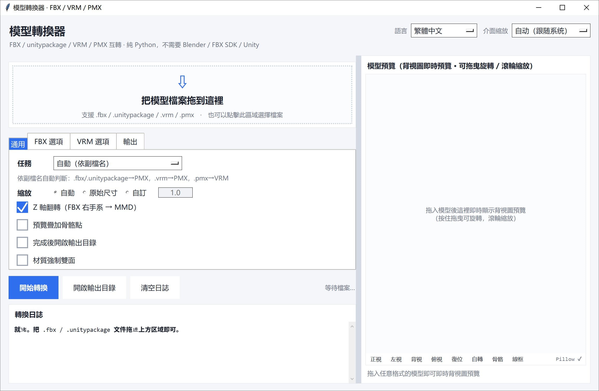

# FBX / VRM / PMX 模型轉換器（純 Python）

把 `.fbx`、`.unitypackage`、`.vrm`、`.pmx` 互相轉換，**全部用 Python 標準庫實作**。
不需要 Blender / Autodesk FBX SDK / Unity 3D，也不需要 mmd_tools / UniVRM 等外掛。直接讀寫二進制格式，拖進視窗即可轉換。

[English](README.md) | [簡體中文](README_SC.md) | [繁體中文](README_TC.md) | [日本語](README_JP.md)


---

## 下載

請從 [releases](https://github.com/SaraKale/Model-to-PMX/releases/latest) 下載最新版本。

## 一、功能特點

### 支援的轉換方向

| 方向 | 說明 |
|---|---|
| FBX / unitypackage → PMX | MMD 用 PMX 2.0，四邊形自動扇形三角化 |
| VRM（0.x / 1.0） → PMX | 自動辨識 humanoid 骨骼，缺的補佔位骨 |
| PMX → VRM（0.x / 1.0） | 自動寫 VRM meta、humanoid 骨骼映射、morph target |
| PMX → 僅校驗 + 預覽 | 唯讀結構校驗，不輸出檔案 |

### 核心特性

- **零外部依賴**：純 Python 標準庫（tkinter + ctypes）。`Pillow` 為可選加速項，
  缺失只影響貼圖解碼速度與部分預覽，不影響主流程。
- **拖放即用**：走 Windows 原生 `WM_DROPFILES`，視窗任意位置都能拖，無需
  tkinterdnd2 之類的第三方函式庫。
- **待轉檔案清單**：拖入後拖放區下方列出 檔名 / 格式 / 大小 與總大小，可追加、
  單選移除、雙擊單獨預覽；**看清單就知道這次要轉什麼**，不點「開始轉換」不動手。
- **即時背視圖預覽**：拖入模型即可看到 3D 背視圖，可拖動旋轉 / 滾輪縮放，
  可疊加骨骼點檢查對齊。
- **多語言介面**：右上角可切換 簡體中文 / 繁體中文 / English / 日本語，選擇記憶到設定。
- **高分屏友善**：依系統 DPI 自動縮放，右上角「介面縮放」可手動指定倍率。
- **分頁式選項**：選項區按「通用 / FBX / VRM / 輸出」分為四個標籤頁，易於擴充。
- **自動繞序判定**：三角形繞序用「幾何面法線 vs 頂點法線」投票自動判定，
  避免出現大面積鏤空 / 輪廓線糊成黑塊。
- **貼圖處理**：PNG/JPEG 直接透傳，BMP/TGA 現轉 PNG，嵌入 GLB 或匯出到 PMX 同目錄。

---

## 二、環境要求

- **Windows**（拖放與 GUI 依賴 Windows 原生 API）
- **Python 3.10+**（推薦 3.12 / 3.13 / 3.14，需自帶 tkinter）
- **可選**：`Pillow`（加速貼圖解碼與預覽）

---

## 三、目錄結構

```
Model-to-PMX/
├── main.py                      # ★ 圖形介面入口（完整實作）
├── main.spec                    # ★ PyInstaller 打包設定
├── config.json                  # 介面設定（語言 / 縮放 / 選項等）
│
├── formats/                     # 格式讀寫 / 解包
│   ├── fbx_reader.py            #   二進制 FBX 7.x 解析函式庫
│   ├── fbx_probe.py             #   探查 FBX 結構（網格/骨骼/蒙皮清單）
│   ├── pmxio.py                 #   完整 PMX 2.0 讀寫（含表情/IK/付與/剛體/關節）
│   ├── vrmio.py                 #   GLB/glTF 容器讀寫 + PNG 編碼 + BMP/TGA 解碼
│   └── unitypackage_unpack.py   #   解包 .unitypackage（gzip tar）
│
├── convert/                     # 轉換引擎
│   ├── fbx2pmx.py               #   FBX → PMX
│   ├── vrm2pmx.py               #   VRM → PMX
│   ├── pmx2vrm.py               #   PMX → VRM
│   └── pmx_check.py             #   PMX 校驗 + 軟體渲染預覽圖
│
├── gfx/
│   └── preview.py               # 即時 3D 背視圖預覽控制項
│
```

> 引擎模組已依職責歸入 `formats/` `convert/` `gfx/` 子目錄，執行期由 `main.py`
> 把這三個目錄插入 `sys.path`，因此模組間仍用裸名 `import`（如 `import fbx2pmx`）。

---

## 四、使用方法

### 方式一：圖形介面（推薦）

1. 輸入執行 `python main.py`
2. 把 `.fbx` / `.unitypackage` / `.vrm` / `.pmx` 檔案**拖進視窗任意位置**，或點擊拖放區選擇檔案。
   **拖入只會載入 + 出預覽，不會自動轉換**；確認任務方向與選項後，點「開始轉換」才會真正執行。
3. 拖放區下方會出現**已選擇的檔案清單**（檔名 / 格式 / 大小），一眼就能看清這次要轉哪些：
   - 繼續拖入是**追加**到清單，重複的檔案依絕對路徑自動去重；
   - 雙擊清單裡的某一列 → 單獨預覽那個檔案；
   - 選取數列後點「移除選取」（或按 Delete），或點「清空清單」重新來過；
   - 清單裡有檔案時，拖放區會收成一條窄帶，把縱向空間讓給清單。
4. 「任務」下拉框可手動指定轉換方向，預設依副檔名自動判斷。切換任務後，已就緒的檔案會依新方向重新篩選（清單同步更新）。
5. 轉換結果與日誌在左下，模型預覽是右欄整列。

介面要點：

- **左右分欄**：像 Blender 那樣可以拖中間的分隔條調整寬度，位置會記進 `config.json`
- **右欄整列預覽**：背視圖即時預覽，底部工具條有 正視 / 左視 / 背視 / 俯視 / 復位 / 自轉 / 骨骼 / 線框
- **右下角渲染後端**：顯示目前用的是 `Pillow` 還是純 Python，以及上一幀耗時（毫秒）
- **右上角「語言」**：簡體中文 / 繁體中文 / English / 日本語（預覽工具條也會跟著切）
- **右上角「介面縮放」**：自動跟隨系統 DPI，或手動指定倍率
- **選項分頁**：「通用 / FBX / VRM / 輸出」四個標籤頁
- **複選項已加大**：勾選框與點擊區域更易點擊

### 預覽為什麼這麼快（大模型也不卡）

即時預覽是純 Python 軟光柵（沒有 OpenGL），因此做了三層配合：

1. **拖曳時用抽稀網格**：自動抽到約 1.2 萬個面做互動幀，90k 面的模型一幀約 40ms；
2. **放手後分片精修**：精修圖每片 1500 個面推進，每個時間片最多佔用 24ms，
   畫面逐塊變清晰，介面不會整塊卡住；
3. **像素預算自適應**：依實測幀耗時自動升降渲染解析度；裝了 Pillow 還會用它
   把低解析度結果放大到畫布尺寸（C 實作）。

### 方式二：命令列

> 路徑含空格或中文時務必加雙引號；引擎腳本位於 `convert/` `formats/` 子目錄。

```powershell
# 開啟圖形介面
python main.py

# FBX → PMX
python convert/fbx2pmx.py "model.fbx" -o "model.pmx"

# 解包 unitypackage（--list 只列內容不解包）
python formats/unitypackage_unpack.py "pack.unitypackage" --list
python formats/unitypackage_unpack.py "pack.unitypackage"

# 探查 FBX 結構
python formats/fbx_probe.py "model.fbx"

# PMX → VRM 1.0（預設）/ 0.x
python convert/pmx2vrm.py "model.pmx" -o "model.vrm"
python convert/pmx2vrm.py "model.pmx" --spec 0x --title "名字" --author "作者"

# VRM → PMX（貼圖自動匯出到 PMX 同目錄）
python convert/vrm2pmx.py "model.vrm" -o "model.pmx"

# PMX 校驗 + 產生預覽圖
python convert/pmx_check.py "model.pmx"
python convert/pmx_check.py "model.pmx" --bones   # 疊加骨骼位置

# 把 PMX 的文字編碼改成 MMD 能讀的 UTF-16LE（修復舊檔案用）
python formats/pmxio.py "model.pmx"               # 輸出 model_utf16.pmx
python formats/pmxio.py "model.pmx" --in-place    # 直接覆蓋（建議先備份）
```

#### 常用參數速查

`fbx2pmx.py`：

| 參數 | 說明 |
|---|---|
| `--scale mmd` | 預設，自動縮放到 MMD 標準身高（約 20 單位） |
| `--scale raw` | 保持 FBX 原始尺寸（公尺） |
| `--scale 12.5` | 手動指定縮放倍數 |
| `--no-flip-z` | 不做右手系→左手系轉換（預設會轉） |
| `--info` | 只印出結構資訊，不轉換 |

`pmx2vrm.py`：`--spec 1.0|0x`、`--scale auto|倍率`、`--rotate auto|none|y180`、
`--flip-winding`、`--force-double-sided`、`--max-morphs N`、`--title` / `--author`。

`vrm2pmx.py`：`--scale`、`--rotate`、`--flip-winding`、`--edge`（開啟輪廓線）、
`--force-double-sided`、`--name`。

更詳細的參數與格式映射，見 `FBX轉PMX_使用說明.md` 與 `VRM互轉_使用說明.md`。

---

## 五、編譯與打包

### 1. 安裝 PyInstaller

```powershell
pip install pyinstaller
pip install pillow          # 可選，讓打包進去的版本也有貼圖加速
```

### 2. 使用 spec 打包（推薦）

> **務必走 spec**，不要直接 `pyinstaller main.py`。

```powershell
pyinstaller main.spec
```

產物：`dist/ModelConvert.exe/ModelConvert.exe`（one-folder 模式）。

### 3. 為什麼必須用 spec

引擎模組已歸入 `formats/` `convert/` `gfx/` 子目錄，而 `main.py` 裡用的是裸名
`import fbx2pmx` 這種寫法，子目錄是在**執行期**才透過 `sys.path.insert` 加進去的。
**PyInstaller 只做靜態分析，看不到執行期的路徑注入**——如果 `pathex` 裡沒有這些
子目錄，打包階段會把它們當「找不到的模組」直接丟棄，程式能打包成功，但一執行就報：

```
ModuleNotFoundError: No module named 'fbx2pmx'
```

`main.spec` 裡已經正確設定好：

```python
Analysis(
    ['main.py'],
    pathex=['.', 'formats', 'convert', 'gfx'],     # 讓靜態分析找到子目錄模組
    hiddenimports=['fbx2pmx', 'pmx_check', 'pmx2vrm', 'vrm2pmx', 'preview',
                   'unitypackage_unpack', 'fbx_reader', 'pmxio', 'vrmio'],
    ...
)
```

如需不用 spec，等價寫法是：

```powershell
pyinstaller --paths formats --paths convert --paths gfx -w main.py
```

### 4. 常用參數

| 參數 | 說明 |
|---|---|
| `-F` | 打包成單個可執行檔 |
| `-D` | 打包成包含多個檔案的資料夾（預設） |
| `-w` | 隱藏控制台視窗（GUI 應用程式） |
| `-i icon.ico` | 指定可執行檔圖示 |
| `-n 名稱` | 指定產生的可執行檔名稱 |
| `--add-data "源:目標"` | 新增資源檔 |
| `--hidden-import 模組名` | 手動補充隱藏依賴 |

---

## 六、注意事項

### 通用

1. **路徑含空格 / 中文**：命令列呼叫時一律加雙引號。
2. **設定檔 `config.json`**：記錄語言、介面縮放、任務方向、各選項等，刪除後會以預設值重建。
1. **快捷鍵與互動**：預覽區可拖動旋轉、滾輪縮放；拖放區點擊可開啟檔案選擇框。

### 模型全黑 / 黑邊 / 鏤空

- **轉換後模型邊緣有黑色線條**：本工具預設會在輸出 PMX 時關閉 MMD 輪廓線（頂點 edge=0、材質 edge_size=0、edge_color alpha=0）。
  若仍看到黑邊，請在 MMD / PMXEditor 裡選取全部材質，確認**輪廓線已關閉**並勾選**「雙面描繪」**。
- **仍有鏤空**：先看日誌裡 `繞序自動判定` 那行。判定錯了加 `--flip-winding`；薄片幾何（頭髮 / 裙擺）依賴雙面渲染則加 `--force-double-sided`，或勾選介面的「材質強制雙面」。

### 已知限制

- **FBX 結構**：僅支援二進制 FBX 7.x；ASCII FBX 不支援。
- **貼圖格式**：DDS / KTX2 / WebP 會被跳過（材質退化為純色）。
- **物理**：PMX 剛體/關節 ↔ VRM SpringBone **不會互相轉換**。
- **材質效果**：球諧貼圖（.sph/.spa）、toon 貼圖在 VRM 側不保留。
- **骨骼名**：FBX 轉換保留英文骨骼名（`Hips`、`Spine` …），直接套 MMD 現成動作（.vmd）匹配不上，需在 PMXEditor 裡批次改為日文標準名。
- **表情**：源模型沒有 BlendShape / morph 時，PMX 表情也為 0，需手工建。

### MMD 提示無法載入（編碼問題）

MMD **只接受文字編碼為 UTF-16LE 的 PMX**。程式內的原版提示是
`MMDではエンコード方式がUTF16のPMXファイルしか読み込めません`
（英文：`MMD can't read UTF8 encorded PMX. Please exchange it to UTF16.`）。
中文漢化版譯成「MMD不能載入編碼為UTF16的PMX文件」，**屬於翻譯錯誤，意思正好相反** ——
看到這句話時，真正的原因是檔案存成了 UTF-8。

本工具輸出的 PMX 一律為 UTF-16LE。舊版匯出的檔案可用
`python formats/pmxio.py "舊檔.pmx"` 修復；介面的驗證日誌也會直接提示
`文本编码是 UTF-8，MMD 无法载入（需要 UTF-16LE）`。

### 拖放相關

- 拖放依賴 Windows 原生 `WM_DROPFILES`，**僅在 Windows 下可用**；其他系統請用「瀏覽」按鈕選擇檔案。
- 若日誌提示「系統未啟用拖放介面」，說明目前環境不支援原生拖放，改用按鈕選擇即可。

### 打包相關

1. **必須用 `pyinstaller main.spec`**（或帶 `--paths` 的等價指令），否則會漏掉子目錄裡的引擎模組，執行時報 `No module named 'fbx2pmx'`。
1. **改了原始碼後必須重新打包**，直接雙擊舊 exe 不會生效。
2. 打包環境的 Python 必須帶 tkinter（Windows 官方安裝包預設包含）。

---

## 七、版權提醒

VRM 的 meta 裡帶授權資訊，本工具預設寫成最保守的「需要署名、禁止再散佈、禁止改版」。

**轉換前請自行確認你有權使用該模型**，工具不會替你做版權檢查。
